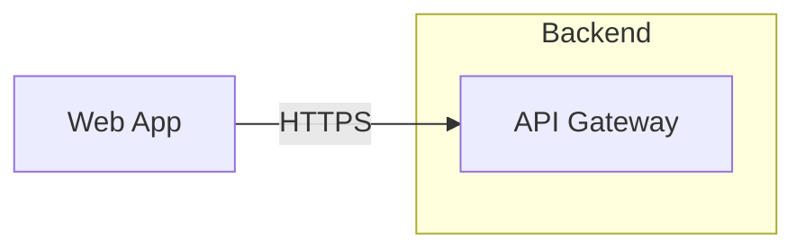
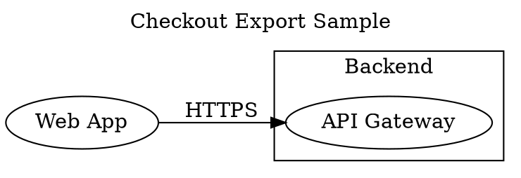

# DiagramSpec

DiagramSpec is the structured source model for DiagramPilot diagrams. It is
designed to be easier for AI coding agents to create, validate, repair, and
update than raw Mermaid, D2, DOT, or SVG.

## Source Files

DiagramSpec is stored as YAML:

- `*.dp.yaml`

Use `diagrampilot format <path>` to parse, validate, and rewrite one
DiagramPilot Source File into canonical YAML key order. Formatting preserves
DiagramSpec data, unknown metadata, and object/array order. DiagramPilot does
not promise comment preservation during formatting; YAML comments may be removed
or moved.

`*.dp.json` is not a DiagramPilot Source File path. Repo discovery ignores JSON
source files, explicit commands reject non-YAML source paths generically, and
DiagramPilot does not provide a migration command.

JSON remains supported for tooling surfaces such as `--json` CLI output, the
DiagramSpec JSON Schema helper, SVG provenance metadata, package manifests, and
other structured integration data.

## JSON Schema Helper

DiagramSpec v1 has a generated, committed JSON Schema at:

```text
https://diagrampilot.com/schema/diagramspec-v1.schema.json
```

Use the schema as a helper for editors, code generators, and other tooling that
need machine-readable source shape. The schema captures required top-level
fields, node cardinality, object field shapes, direction values, stable ID
patterns, namespaced icon references, and well-known metadata references where
JSON Schema is practical.

The schema does not replace `diagrampilot validate`; core validation remains authoritative.
It covers source shape, while validation covers semantic rules such as global ID
uniqueness, edge endpoint references, group containment references, group
cycles, and supported Lucide icon names.

## Principles

- DiagramSpec is the source of truth.
- DiagramPilot source files are edited; derived artifacts are regenerated.
- Every diagram object has a globally unique stable ID.
- Stable IDs are preserved across updates.
- Rendering and export output is generated from the source file.
- Mermaid, D2, DOT, SVG, and PNG are derived artifacts, not primary source.

## Minimal DiagramSpec

```yaml
version: 1
title: Checkout Architecture
nodes:
  - id: web_app
    label: Web App
  - id: api_gateway
    label: API Gateway
edges:
  - id: web_app_to_api_gateway
    from: web_app
    to: api_gateway
    label: HTTPS
```

## Top-Level Fields

```yaml
version: 1
title: System Architecture
description: Optional plain-text summary.
direction: right
nodes: []
edges: []
groups: []
views: []
metadata: {}
```

Required top-level fields:

- `version`
- `title`
- `nodes`

`nodes` must contain at least one node.

Optional top-level fields:

- `description`
- `direction`
- `edges`
- `groups`
- `views`
- `metadata`

## Field Contract

`version`
: Required. DiagramPilot spec version. Start with `1`.

`title`
: Required. Human-readable diagram title.

`description`
: Optional. Plain-text explanation of what the diagram represents.

`direction`
: Optional. Preferred layout direction: `right`, `left`, `down`, or `up`.
Defaults to `right`.

`nodes`
: Required. List of diagram nodes. Must contain at least one node.

`edges`
: Optional. List of connections between nodes.

`groups`
: Optional. Logical containers for nodes or other groups.

`views`
: Optional. Named projections that filter the same DiagramSpec source for
focused render or export output.

`metadata`
: Optional. Free-form object for project, source, owner, or generation details.
DiagramPilot preserves unknown metadata keys.

## IDs

All node, edge, and group IDs share one namespace inside a DiagramSpec. IDs must
be globally unique across all diagram objects.

IDs must use lowercase snake case:

```text
^[a-z][a-z0-9]*(?:_[a-z0-9]+)*$
```

Good:

```text
api_gateway
orders_service
orders_db
web_app_to_api_gateway
```

Avoid:

```text
node1
boxA
new-api-gateway!!!
API Gateway
1_api_gateway
api__gateway
```

## Text

Labels and descriptions are plain text, not Markdown. Labels may include line
breaks when a rendered diagram needs them.

## Nodes

```yaml
nodes:
  - id: api_gateway
    label: API Gateway
    kind: service
    description: Routes public API traffic.
    icon: lucide:server
    metadata:
      source: src/gateway
      external_url: https://example.com/api-gateway-notes
```

Required node fields:

- `id`
- `label`

Optional node fields:

- `kind`
- `description`
- `icon`
- `metadata`

Nodes are the only valid edge endpoints in DiagramSpec v1.

## Kinds

`kind` is an open semantic tag. It is not a strict diagram type enum.

Known kinds may influence styling or export behavior, while unknown kinds remain
valid if they use the stable ID shape.

Examples:

```text
frontend
service
database
start
process
decision
package
```

## Icons

`icon` is an optional namespaced icon reference:

```yaml
icon: lucide:database
```

Icon namespaces use lowercase names. Lucide icon names use the packaged Lucide
kebab-case names, such as `database-backup`. MVP renderers support packaged
Lucide icons. Validation rejects unsupported icon namespaces and unknown icons
in supported namespaces.

Use the [Icon reference](icons.md) or `diagrampilot icons search <query>` to
discover valid packaged `lucide:*` references locally.

Reserved icon namespaces include:

```text
aws
gcp
azure
custom
```

## Edges

```yaml
edges:
  - id: web_app_to_api_gateway
    from: web_app
    to: api_gateway
    label: HTTPS
    kind: request
    directed: true
```

Required edge fields:

- `id`
- `from`
- `to`

Optional edge fields:

- `label`
- `kind`
- `description`
- `directed`
- `metadata`

`from` and `to` must reference existing node IDs. Edges are directed by default.
Use `directed: false` for an undirected connection.

Edge IDs are stable identities. Endpoint-derived IDs are recommended for new
edges, but an existing edge ID should not be automatically regenerated when an
edge is rerouted.

## Groups

```yaml
groups:
  - id: backend
    label: Backend
    contains:
      - api_gateway
      - orders_service
      - orders_db
```

Required group fields:

- `id`
- `label`
- `contains`

Optional group fields:

- `kind`
- `description`
- `icon`
- `metadata`

`contains` may reference existing node IDs or group IDs. Groups may nest, but
validation rejects group cycles and duplicate containment. Each contained node
or group has at most one parent group in DiagramSpec v1.

Groups are not valid edge endpoints in DiagramSpec v1.

## Views

Views are named projections from one DiagramPilot Source File. They are not
separate source files, and they do not replace the canonical full DiagramSpec.
Use them when a large diagram needs smaller review artifacts for audiences such
as runtime, data-flow, security, or executive overviews.

```yaml
views:
  - id: runtime
    label: Runtime
    groups:
      - backend
    nodeKinds:
      - service
    edgeKinds:
      - request
      - data_flow
```

Required view fields:

- `id`

Optional view fields:

- `label`
- `description`
- `groups`
- `nodes`
- `edges`
- `nodeKinds`
- `edgeKinds`
- `metadata`

View IDs use the stable ID shape. `groups`, `nodes`, and `edges` reference
existing object IDs. `nodeKinds` and `edgeKinds` match existing `kind` values.
Validation reports repairable diagnostics for duplicate view IDs, unknown
referenced objects, and filters that match nothing.

Render or export a projection without mutating the source file:

```bash
diagrampilot inspect docs --json
diagrampilot render docs/architecture.dp.yaml --view runtime --out docs/architecture-runtime.svg
diagrampilot export docs/architecture.dp.yaml --view runtime --format mermaid --out docs/architecture-runtime.mmd
```

Focused render filters can also create smaller SVG review artifacts from the
same validated source without adding more DiagramSpec fields:

```bash
diagrampilot render docs/architecture.dp.yaml --group checkout_runtime --out docs/architecture-checkout-runtime.svg
diagrampilot render docs/architecture.dp.yaml --around orders_service --depth 1 --out docs/architecture-orders-service.svg
diagrampilot render docs/architecture.dp.yaml --hide-edge-labels --out docs/architecture-overview.svg
```

Use `--group` for one containment boundary, `--around` with `--depth` for a
node neighborhood, and `--hide-edge-labels` for overview artifacts. These
filters compose after `--view` when a view is also provided.

## Metadata

`metadata` is a free-form object. DiagramPilot may define well-known keys while
preserving unknown keys.

Well-known keys:

`source`
: Local repository path or path-like glob that connects the diagram concept to
repo content.

`external_url`
: External URL that points to supporting context outside the local repository.

## Styling And Layout

DiagramSpec v1 has no arbitrary per-object styling. Use `kind` and `icon` for
semantic rendering hints.

MVP layout configuration is limited to top-level `direction`.

## Interop

MVP export targets:

- Mermaid
- D2
- DOT

MVP rendering targets:

- SVG
- PNG

Interop targets are not the source of truth.

## Export Fidelity

DiagramPilot Source Files remain the source of truth. Mermaid, D2, and DOT are
Derived Artifacts for review, embedding, and tool interoperability. The same
small DiagramSpec can be exported to each target, but each target keeps only the
semantics that fit its format.

Source:

```yaml
version: 1
title: Checkout Export Sample
direction: right
nodes:
  - id: web_app
    label: Web App
    kind: frontend
    icon: lucide:globe
    metadata:
      source: src/web/checkout-page.tsx
  - id: api_gateway
    label: API Gateway
    kind: service
    icon: lucide:server
groups:
  - id: backend
    label: Backend
    contains:
      - api_gateway
edges:
  - id: web_app_to_api_gateway
    from: web_app
    to: api_gateway
    label: HTTPS
```

### Mermaid



### D2

```d2
direction: right

web_app: "Web App"
backend: {
  label: "Backend"
  api_gateway: "API Gateway"
}

web_app -> backend.api_gateway: "HTTPS"
```

### DOT



Read preserved as meaning the semantic is represented directly, approximated as
meaning the target uses a native construct with similar review value, and
dropped as meaning the target output does not carry that DiagramSpec field.

| Semantic | Mermaid | D2 | DOT |
| --- | --- | --- | --- |
| Titles | Dropped; Mermaid output starts with `flowchart`. | Dropped; D2 output starts with `direction`. | Preserved as the digraph name and top label. |
| Directions | Preserved as `LR`, `RL`, `TB`, or `BT`. | Preserved as `direction`. | Preserved as `rankdir`. |
| Nodes | Preserved as Stable IDs and labels. | Preserved as Stable IDs and labels. | Preserved as Stable IDs and labels. |
| Groups | Approximated as Mermaid subgraphs. | Preserved as nested containers; edge endpoints use container paths. | Approximated as Graphviz clusters. |
| Edge labels | Preserved with Mermaid edge labels. | Preserved after the connection. | Preserved as edge `label` attributes. |
| Edge direction | Preserved with arrow or undirected connectors. | Preserved with directed or undirected connectors. | Preserved with directed edges and `dir=none` for undirected edges. |
| Icons | Dropped. | Dropped. | Dropped. |
| Kinds | Dropped. | Dropped. | Dropped. |
| Metadata | Dropped. | Dropped. | Partly preserved: `source` becomes `tooltip`, and `external_url` becomes `URL`; other metadata is dropped. |
| Provenance | Dropped; SVG provenance is only in generated SVG artifacts. | Dropped; SVG provenance is only in generated SVG artifacts. | Dropped; SVG provenance is only in generated SVG artifacts. |
| Views and layout hints | Dropped because these fields are outside the current DiagramSpec v1 source contract. | Dropped because these fields are outside the current DiagramSpec v1 source contract. | Dropped because these fields are outside the current DiagramSpec v1 source contract. |
